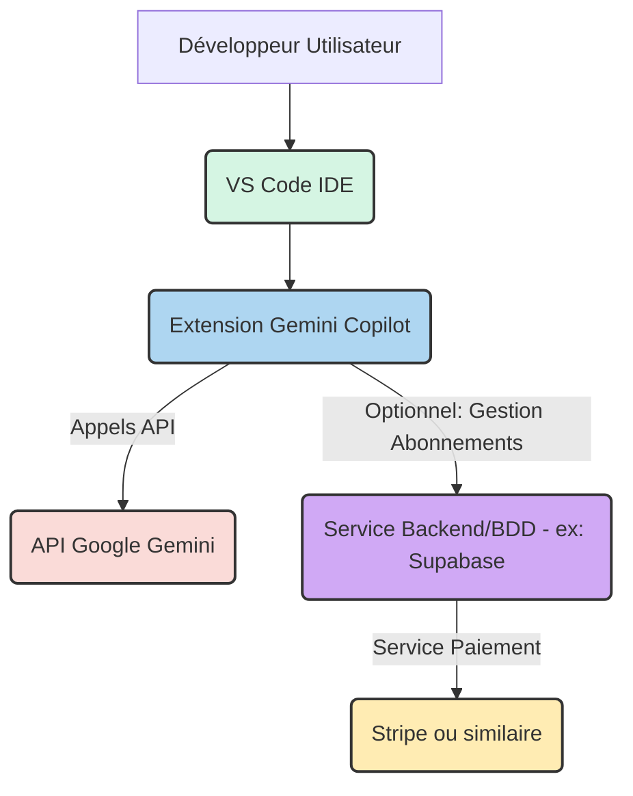

# Architecture du Projet - Gemini Copilot

## 1. Vue d'ensemble de l'Architecture

L'architecture de Gemini Copilot est conçue pour une intégration fluide dans l'IDE VS Code tout en interagissant avec des services externes pour les fonctionnalités d'IA et potentiellement la gestion des abonnements.

L'Extension Gemini Copilot s'exécute dans l'environnement de l'IDE VS Code. Elle utilise les APIs de VS Code pour interagir avec l'éditeur (accès au code, affichage de suggestions, création de panneaux). Les fonctionnalités d'IA sont fournies par l'API Google Gemini, appelée directement ou via un service intermédiaire si nécessaire pour la gestion sécurisée des clés API. Un service backend optionnel est envisagé pour gérer les abonnements et interagir avec un service de paiement.

## 2. Composants Clés

- **Extension VS Code :** Le cœur du système, responsable de l'intégration avec l'IDE, de la gestion des interactions utilisateur et de la communication avec les services externes. Développée en TypeScript.
- **API Google Gemini :** Fournit les modèles d'IA pour la complétion, la génération, l'explication et la documentation du code.
- **Service Backend (Optionnel) :** Gère la logique liée aux abonnements, l'authentification des utilisateurs (si nécessaire au-delà de l'identification VS Code), et l'interaction sécurisée avec les services de paiement. Potentiellement basé sur Supabase ou un service similaire.
- **Base de Données (Optionnelle) :** Stocke les informations relatives aux utilisateurs et aux abonnements si un service backend est implémenté.
- **Service de Paiement (Optionnel) :** Gère les transactions d'abonnement (ex: Stripe).

## 3. Flux de Données

1.  L'utilisateur interagit avec l'extension dans VS Code (tape du code, sélectionne du texte, déclenche une commande).
2.  L'extension capture le contexte pertinent de l'éditeur.
3.  L'extension envoie une requête à l'API Google Gemini (potentiellement via un backend) avec le contexte et la tâche demandée (complétion, génération, explication, documentation).
4.  L'API Google Gemini traite la requête et renvoie le résultat (suggestions de code, texte explicatif, documentation).
5.  L'extension reçoit le résultat et l'affiche à l'utilisateur dans l'interface de VS Code (suggestions inline, panneau latéral, etc.).
6.  (Pour les abonnements) L'extension ou un service backend gère les interactions avec le service de paiement et met à jour la base de données.

## 4. Considérations Techniques

- **Performance :** Minimiser la latence des appels API et optimiser le traitement côté extension pour une expérience fluide.
- **Sécurité :** Gérer les clés API et les données utilisateur de manière sécurisée.
- **Évolutivité :** L'architecture doit pouvoir gérer un nombre croissant d'utilisateurs et de requêtes.
- **Maintenabilité :** Code modulaire et bien documenté.

## 5. Technologies Utilisées

- **Extension VS Code :** TypeScript
- **Modèle IA :** Google Gemini
- **Backend/Base de données (Optionnel) :** À définir (ex: Supabase)
- **Service de Paiement (Optionnel) :** À définir (ex: Stripe)
- **APIs VS Code**
- **Variables de Thème CSS de VS Code**

## 6. Schéma de Base de Données (Optionnel - si backend implémenté)

Voir la spécification détaillée du modèle de données si un backend est mis en place pour la gestion des abonnements.

## 7. Intégrations Tierces

- API Google Gemini
- Service de paiement (ex: Stripe)
- MCPs potentiellement utilisés (voir PRD Section 5.6.1)

## 8. Déploiement

L'extension est déployée via le Visual Studio Code Marketplace. Le service backend (si présent) sera déployé séparément sur une plateforme cloud (ex: Vercel, Netlify, Google Cloud Functions, etc.).

## 9. Maintenance

La maintenance inclura la surveillance des erreurs, les mises à jour des dépendances, l'adaptation aux changements d'API et la publication de nouvelles versions via le Marketplace.
