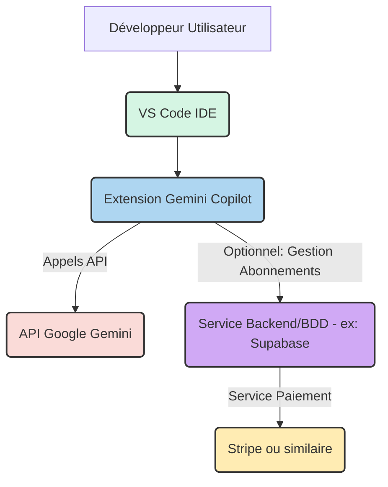

# Product Requirements Document (PRD) - Gemini Copilot

**Project Name:** Gemini Copilot
**Version:** 1.0
**Last Updated:** 17/05/2025
**Author(s):** Utilisateur (Initial Idea) & AI Coding Agent (Elaboration)
**Key Stakeholders:** Utilisateur, AI Coding Agent

**Preamble: Streamlined Workflow Approach**
This PRD template is designed for a streamlined workflow where the primary user input is the core project idea and desired high-level features. The AI Coding Agent is expected to take significant initiative in proposing technical details, design elements, and specific tooling. While a Next.js and Supabase stack is suggested as a default (and detailed in Section 1.10), this is a recommendation. The user will have the final say in choosing the most appropriate frontend, backend, and other technologies based on project needs, PRD analysis, market research, or other factors. Human validation will occur at key decision points proposed by the AI, as outlined in the AI-Human Interaction Protocol (Section 1.11).

---

## 0. AI Agent Onboarding and PRD Interpretation Protocol

_AI Agent Directive: Your first task is to read and analyze this entire PRD to understand its structure, objectives, and directives. Build an internal representation of interdependencies between sections (e.g., how NFRs influence feature decomposition, how design preferences guide UI proposals). When one section references another, ensure you follow these links for comprehensive understanding. Utilize the Glossary (Section 11) to clarify terms. You must maintain an internal state of tasks as outlined in Section 1.11 (AI-Human Interaction and Validation Protocol) and communicate this status clearly (e.g., by interacting with Roo Orchestrator, or by updating a status field in this PRD or a linked document)._
_Familiarize yourself with the list of currently connected MCP Servers and their primary tools as outlined in Section 5.6.1 (Known and Desired MCP Catalog) and any supplementary documentation provided (e.g., the `AI_Docs/MCP-Context.txt` file if it details these MCPs). This is your primary toolkit for interacting with external services._

---

## Table of Contents

<!-- AI Agent to Auto-generate/Update -->

1.  [Introduction and Objectives](#1-introduction-and-objectives)
    1.1. [Document Purpose](#11-document-purpose)
    1.2. [Project Idea & Core Problem (User Input)](#12-project-idea--core-problem-user-input)
    1.3. [Product Vision (AI to Propose, User to Validate)](#13-product-vision-ai-to-propose-user-to-validate)
    1.4. [Business Goals (AI to Propose based on Idea, User to Validate)](#14-business-goals-ai-to-propose-based-on-idea-user-to-validate)
    1.5. [Key Performance Indicators (KPIs) (AI to Propose, User to Validate)](#15-key-performance-indicators-kpis-ai-to-propose-user-to-validate)
    1.6. [Project Scope (AI to Propose based on Features, User to Validate)](#16-project-scope-ai-to-propose-based-on-features-user-to-validate)
    1.7. [Out of Scope (AI to Propose, User to Validate)](#17-out-of-scope-ai-to-propose-user-to-propose-user-to-validate)
    1.8. [Guiding Principles for the AI Agent](#18-guiding-principles-for-the-ai-agent)
    1.9. [Agentic Coding System Overview](#19-agentic-coding-system-overview)
    1.10. [Default Technology Stack & AI Initiative in Tooling](#110-default-technology-stack--ai-initiative-in-tooling)
    1.10.1. [Access to Project Context for AI Agent](#1101-access-to-project-context-for-ai-agent)
    1.11. [AI-Human Interaction and Validation Protocol](#111-ai-human-interaction-and-validation-protocol)
2.  [Market and User Analysis (AI to Assist/Research if Instructed)](#2-market-and-user-analysis-ai-to-assistresearch-if-instructed)
    2.1. [Market Research Summary (Optional User Input / AI Research Task)](#21-market-research-summary-optional-user-input--ai-research-task)
    2.2. [Problem(s) to Solve (Elaborated by AI from User Input)](#22-problems-to-solve-elaborated-by-ai-from-user-input)
    2.3. [Target Audience (AI to Propose, User to Validate)](#23-target-audience-ai-to-propose-user-to-validate)
    2.4. [User Personas (AI to Generate Drafts, User to Validate)](#24-user-personas-ai-to-generate-drafts-user-to-validate)
    2.5. [Competitive Analysis (Optional User Input / AI Research Task)](#25-competitive-analysis-optional-user-input--ai-research-task)
    2.6. [Unique Value Proposition (UVP) (AI to Propose, User to Validate)](#26-unique-value-proposition-uvp-ai-to-propose-user-to-validate)
3.  [Functional Requirements (User Input & AI Elaboration)](#3-functional-requirements-user-input--ai-elaboration)
    3.1. [High-Level Feature List (User Input)](#31-high-level-feature-list-user-input)
    3.2. [User Stories (AI to Generate from Features, User to Validate)](#32-user-stories-ai-to-generate-from-features-user-to-validate)
    3.3. [Use Cases (AI to Generate for Complex Features, User to Validate)](#33-use-cases-ai-to-generate-for-complex-features-user-to-validate)
    3.4. [User Flows (AI to Propose, User to Validate)](#34-user-flows-ai-to-propose-user-to-validate)
    3.5. [Localization and Internationalization (L10n / I18n) Requirements (AI to Query User if Potentially Needed)](#35-localization-and-internationalization-l10n--i18n-requirements-ai-to-query-user-if-potentially-needed)
    3.6. [Preliminary API Design (AI to Propose if applicable, User to Validate)](#36-preliminary-api-design-ai-to-propose-if-applicable-user-to-validate)
4.  [Non-Functional Requirements (NFRs) (AI to Propose Defaults, User to Adjust)](#4-non-functional-requirements-nfrs-ai-to-propose-defaults-user-to-adjust)
    4.1. [Performance](#41-performance)
    4.2. [Scalability](#42-scalability)
    4.3. [Security](#43-security)
    4.4. [Reliability and Availability](#44-reliability-and-availability)
    4.5. [Maintainability](#45-maintainability)
    4.6. [Usability and Accessibility (UX/UI & A11Y)](#46-usability-and-accessibility-uxui--a11y)
    4.7. [Compatibility (Browsers, Devices, OS)](#47-compatibility-browsers-devices-os)
    4.8. [Regulatory Compliance (AI to Query User if Potentially Relevant)](#48-regulatory-compliance-ai-to-query-user-if-potentially-relevant)
    4.9. [Documentation (Product & Technical)](#49-documentation-product--technical)
    4.10. [NFR Verification Criteria for AI Agent](#410-nfr-verification-criteria-for-ai-agent)
5.  [Design and Architecture (AI to Propose, User to Validate)](#5-design-and-architecture-ai-to-propose-user-to-validate)
    5.1. [Design Philosophy and Principles (Agentic Design - User to Provide Preferences)](#51-design-philosophy-and-principles-agentic-design---user-to-provide-preferences)
    5.2. [Design System & UI Implementation Strategy (AI to Propose based on User Preferences & Defaults)](#52-design-system--ui-implementation-strategy-ai-to-propose-based-on-user-preferences--defaults)
    5.2.1. [Core UI Components List (AI to Propose Initial List)](#521-core-ui-components-list-ai-to-propose-initial-list)
    5.2.2. [Interaction Design Principles (AI to Propose Key Principles)](#522-interaction-design-principles-ai-to-propose-key-principles)
    5.2.3. [Accessibility (A11Y) Specific Targets (AI to Propose)](#523-accessibility-a11y-specific-targets-ai-to-propose)
    5.3. [Proposed System Architecture (AI to Generate)](#53-proposed-system-architecture-ai-to-generate)
    5.4. [Technology Stack (User Override / Confirmation of Defaults)](#54-technology-stack-user-override--confirmation-of-defaults)
    5.5. [Data Requirements (AI to Propose Model based on Features)](#55-data-requirements-ai-to-propose-model-based-on-features)
    5.6. [Third-Party Integrations & MCP Servers (AI to Propose Solutions based on Needs)](#56-third-party-integrations--mcp-servers-ai-to-propose-solutions-based-on-needs)
    5.6.1. [Known and Desired MCP Catalog](#561-known-and-desired-mcp-catalog)
    5.7. [Directory Structure and Naming Conventions (AI to Adhere to Defaults)](#57-directory-structure-and-naming-conventions-ai-to-adhere-to-defaults)
    5.8. [Agentic Project Boilerplate (Conceptual - AI to Assume)](#58-agentic-project-boilerplate-conceptual---ai-to-assume)
6.  [Test and Validation Plan (AI to Propose, User to Validate)](#6-test-and-validation-plan-ai-to-propose-user-to-validate)
    6.1. [Test Strategy (Including AI Generation)](#61-test-strategy-including-ai-generation)
    6.1.1. [Definition of Done (DoD) for UI Tasks (AI to Propose)](#611-definition-of-done-dod-for-ui-tasks-ai-to-propose)
    6.2. [Acceptance Criteria (Gherkin/BDD Format - AI to Generate)](#62-acceptance-criteria-gherkinbdd-format---ai-to-generate)
    6.3. [Detailed Test Scenarios for AI Agent (AI to Generate)](#63-detailed-test-scenarios-for-ai-agent-ai-to-generate)
    6.4. [User Acceptance Testing (UAT) (User to Define Process)](#64-user-acceptance-testing-uat-user-to-define-process)
    6.5. [Performance, Security, etc. Tests (Criteria for AI - AI to Propose)](#65-performance-security-etc-tests-criteria-for-ai---ai-to-propose)
7.  [Deployment and Launch Plan (AI to Propose, User to Validate)](#7-deployment-and-launch-plan-ai-to-propose-user-to-validate)
    7.1. [Deployment Strategy](#71-deployment-strategy)
    7.2. [Deployment Prerequisites](#72-deployment-prerequisites)
    7.3. [Deployment Scripts (Instructions for AI Agent)](#73-deployment-scripts-instructions-for-ai-agent)
    7.4. [Rollback Plan](#74-rollback-plan)
    7.5. [Launch Communication](#75-launch-communication)
8.  [Maintenance and Future Evolutions (User Input & AI Suggestions)](#8-maintenance-and-future-evolutions-user-input--ai-suggestions)
    8.1. [Maintenance Plan (AI to Propose Basics)](#81-maintenance-plan-ai-to-propose-basics)
    8.2. [Ideas for Future Releases (User Input / AI Brainstorming)](#82-ideas-for-future-releases-user-input--ai-brainstorming)
9.  [AI Agent Specific Instructions](#9-ai-agent-specific-instructions)
    9.1. [Feature Decomposition and Specification Process (Mandatory Pre-Coding Step for AI)](#91-feature-decomposition-and-specification-process-mandatory-pre-coding-step-for-ai)
    9.2. [Coding Style and Linters](#92-coding-style-and-linters)
    9.3. [Dependency Management](#93-dependency-management)
    9.4. [Code Documentation Generation](#94-code-documentation-generation)
    9.5. [Commit and Versioning Strategy](#95-commit-and-versioning-strategy)
    9.6. [Feedback Loop and Self-Correction](#96-feedback-loop-and-self-correction)
    9.7. [AI Initiative in Tooling, MCP Server, and Service Selection](#97-ai-initiative-in-tooling-mcp-server-and-service-selection)
    9.7.1. [Protocol for Proposing and Learning New Tools/MCPs](#971-protocol-for-proposing-and-learning-new-toolsmcps)
    9.8. [Workflow with Assisted Coding Tools (e.g., Cursor, Cline)](#98-workflow-with-assisted-coding-tools-eg-cursor-cline)
    9.9. [Standard MCP Integration Logic (Using Supabase as a Hub)](#99-standard-mcp-integration-logic-using-supabase-as-a-hub)
10. [Risks and Dependencies (AI to Identify, User to Validate)](#10-risks-and-dependencies-ai-to-identify-user-to-validate)
    10.1. [Risk Identification](#101-risk-identification)
    10.2. [Risk Mitigation Plan](#102-risk-mitigation-plan)
    10.3. [Dependencies](#103-dependencies)
11. [Glossary (AI to Maintain)](#11-glossary-ai-to-maintain)
12. [Appendices (User or AI to Add as Needed)](#12-appendices-user-or-ai-to-add-as-needed)

---

## 0. AI Agent Onboarding and PRD Interpretation Protocol

_AI Agent Directive: Your first task is to read and analyze this entire PRD to understand its structure, objectives, and directives. Build an internal representation of interdependencies between sections (e.g., how NFRs influence feature decomposition, how design preferences guide UI proposals). When one section references another, ensure you follow these links for comprehensive understanding. Utilize the Glossary (Section 11) to clarify terms. You must maintain an internal state of tasks as outlined in Section 1.11 (AI-Human Interaction and Validation Protocol) and communicate this status clearly (e.g., by interacting with Roo Orchestrator, or by updating a status field in this PRD or a linked document). Familiarize yourself with the list of currently connected MCP Servers and their primary tools as outlined in Section 5.6.1 (Known and Desired MCP Catalog) and any supplementary documentation provided (e.g., the `AI_Docs/MCP-Context.txt` file if it details these MCPs). This is your primary toolkit for interacting with external services._

---

## 1. Introduction and Objectives

### 1.1. Document Purpose

_Comment: This document serves as the primary input for the AI Coding Agent, which will elaborate on technical specifications based on the user's high-level input. It outlines the project idea, desired features, and establishes the framework for the AI to propose detailed solutions within the "Agentic Coding System"._
Ce document sert de guide pour le développement de l'extension VS Code "Gemini Copilot". Il détaille la vision du produit, les objectifs, les exigences fonctionnelles et non fonctionnelles, ainsi que les considérations techniques et de conception. Il est destiné à l'agent de codage IA pour qu'il puisse procéder à l'implémentation.

### 1.2. Project Idea & Core Problem (User Input)

_User Instruction: Please provide the core idea of your project and the main problem it aims to solve. Be as clear and concise as possible. The AI Agent can elaborate further if market research data is available or if it's instructed to perform high-level research._
**Idée du projet :** Une extension VS Code pour assister les développeurs en fournissant des fonctionnalités de complétion, génération, explication et documentation de code basées sur l'IA.
**Problème principal :** L'assistance au codage actuelle dans VS Code est limitée. Les développeurs ont besoin d'outils plus puissants pour accélérer leur flux de travail, mieux comprendre le code existant et générer de la documentation.

### 1.3. Product Vision (AI to Propose, User to Validate)

_Comment: Based on the user's idea, the AI will propose a long-term vision for the product._
_AI Instruction: Based on the `Project Idea & Core Problem`, propose a compelling product vision. Consider potential impact and future evolution._
**PROPOSAL FOR VALIDATION:**
Devenir l'outil d'assistance au codage basé sur l'IA de référence pour les développeurs VS Code, en offrant une suite complète de fonctionnalités intelligentes qui couvrent l'ensemble du cycle de vie du développement, de l'idéation à la maintenance, permettant ainsi aux développeurs de se concentrer sur la résolution de problèmes complexes et l'innovation.

### 1.4. Business Goals (AI to Propose based on Idea, User to Validate)

_Comment: The AI will propose SMART business goals aligned with the project idea._
_AI Instruction: Based on the `Project Idea & Core Problem`, propose 2-3 SMART (Specific, Measurable, Achievable, Relevant, Time-bound) business goals._
**PROPOSAL FOR VALIDATION:**

1.  **Acquisition d'utilisateurs :** Atteindre 10 000 installations actives sur le marketplace VS Code dans les 12 mois suivant le lancement initial.
2.  **Monétisation :** Convertir 5% des utilisateurs en période d'essai en abonnés payants (modèle mensuel/annuel) dans les 18 mois.
3.  **Satisfaction utilisateur :** Obtenir une note moyenne de 4.5 étoiles ou plus sur le marketplace VS Code dans les 9 mois.

### 1.5. Key Performance Indicators (KPIs) (AI to Propose, User to Validate)

_Comment: The AI will propose KPIs to measure the success of the proposed business goals._
_AI Instruction: For each proposed Business Goal, suggest 1-2 relevant KPIs._
**PROPOSAL FOR VALIDATION:**

- **Pour l'acquisition d'utilisateurs :**
  - Nombre total d'installations actives.
  - Taux de croissance mensuel des installations.
- **Pour la monétisation :**
  - Taux de conversion essai -> abonnement.
  - Revenu Mensuel Récurrent (RMR).
- **Pour la satisfaction utilisateur :**
  - Note moyenne sur le marketplace VS Code.
  - Nombre de retours positifs vs négatifs.

### 1.6. Project Scope (AI to Propose based on Features, User to Validate)

_Comment: The AI will define the initial scope based on the user's feature list._
_AI Instruction: Based on the `High-Level Feature List` (Section 3.1), define what is IN SCOPE for the initial development phase._
**PROPOSAL FOR VALIDATION:**
Le périmètre initial du projet (MVP) inclut le développement et l'implémentation des fonctionnalités clés suivantes au sein de l'extension VS Code :

- Complétion de Code Intelligente
- Génération de Code
- Explication de Code
- Documentation de Code

### 1.7. Out of Scope (AI to Propose, User to Validate)

_Comment: The AI will suggest items that are explicitly out of scope for clarity._
_AI Instruction: Based on the `Project Scope`, identify and list key items that are OUT OF SCOPE for this initial phase._
**PROPOSAL FOR VALIDATION:**
Les éléments suivants sont explicitement hors du périmètre pour la phase initiale du projet :

- Support de tous les langages de programmation possibles (focus sur les langages les plus courants initialement).
- Fonctionnalités de revue de code automatisée complexe.
- Intégration avec des systèmes de gestion de projet (Jira, Trello, etc.).
- Fonctionnalités de collaboration en temps réel entre utilisateurs.
- Déploiement sur d'autres IDEs que VS Code.
- Modèle économique autre que l'abonnement mensuel/annuel.

### 1.8. Guiding Principles for the AI Agent

_Comment: These are foundational principles for the AI's operation._

- **Excellence in Design and UX/UI:** The goal is to produce interfaces and user experiences of exceptional quality, worthy of the highest standards (like "Silicon Valley / Y Combinator"). This takes precedence over mere functionality.
- Strict adherence to the Agentic Design System (Section 5.1 & 5.2), which must reflect this ambition.
- Prioritize code clarity, maintainability, and testability.
- Implement security best practices by default.
- Optimize for performance as per NFRs (Section 4.1).
- Generate comprehensive tests (unit, integration, assist with E2E).
- Proactively propose solutions, libraries, MCP servers, and Supabase services, documenting rationale for human review.
- Communicate ambiguities or need for clarification promptly (Section 9.1.10).
- Follow all instructions within this PRD meticulously.
- **Embrace Iterative Exploration:** Be prepared to generate multiple alternatives for UI components, logic flows, or technical solutions when prompted or when a clear optimal path isn't immediately evident from the PRD. The goal is to rapidly explore the solution space with human guidance, facilitating quick feedback and 'vibe-driven' development. Clearly label exploratory suggestions versus production-ready proposals.
- **Contextual Awareness:** Strive to understand the broader project context by referring to all relevant sections of this PRD, existing codebase (if available and accessible as per Section 1.10.1), and project documentation before making decisions or generating code.
  `[User can add specific overriding principles if any]`

### 1.9. Agentic Coding System Overview

_Comment: This system emphasizes technical excellence, design finesse, close Design <> Dev collaboration (even with AI), exhaustive documentation, and rapid iteration._

- **Core Tenets:**
- **Technical Excellence:** Clean, well-tested, performant, and maintainable code.
- **Design Finesse:** Meticulous attention to detail, resulting in a polished and intuitive user experience. Adherence to the Gemini Copilot Design System is paramount.
- **Collaboration:** Seamless integration between user requirements and AI execution, facilitated by this PRD and AI's clarification process.
- **Documentation:** AI-assisted generation of comprehensive documentation for code, design system components, and APIs.
- **Iteration:** AI facilitates rapid development cycles based on feedback and continuous improvement.
  `[AI to ensure its processes align with these tenets]`

### 1.10. Default Technology Stack & AI Initiative in Tooling

_Comment: Defines the default technical foundation and AI's role in tool selection._
This project suggests the following default technology stack, which can be overridden by user input in Section 5.4:

- **Suggested Frontend:** Next.js (with TypeScript) - _Adaptation pour Extension VS Code :_ TypeScript pour le développement de l'extension VS Code.
- **Suggested Backend/Database:** Supabase (PostgreSQL, Auth, Storage, Edge Functions) - _Adaptation pour Extension VS Code :_ L'extension communiquera avec l'API de Google Gemini. Un backend/base de données peut être nécessaire pour la gestion des abonnements et des utilisateurs, potentiellement via Supabase ou un service similaire.
- **Suggested Styling:** Tailwind CSS (with a custom Design System inspired by Shadcn/ui, as per Section 5.2) - _Adaptation pour Extension VS Code :_ Utilisation des APIs de thème de VS Code pour s'intégrer nativement. Un système de design peut être défini pour les éléments d'interface utilisateur personnalisés (panneaux, pop-ups).
  The final choice of technologies will be determined by the user, considering project requirements and analyses.

The AI Coding Agent is empowered and expected to:

1.  Select appropriate, stable versions for the core stack elements.
2.  Identify, research, propose, and integrate relevant auxiliary libraries, **MCP servers** (e.g., pour l'accès à l'API Gemini via un MCP dédié si disponible, ou pour la gestion des abonnements via Stripe MCP), and third-party APIs compatible with the chosen stack to best achieve the project goals. Task management is handled by Roo Orchestrator/Code (see [`../../../02_AI-DOCS/TaskManagement/Roo_Task_Workflow.md`](../../../02_AI-DOCS/TaskManagement/Roo_Task_Workflow.md) for workflow and [`../../../02_AI-DOCS/TaskManagement/Tasks_JSON_Structure.md`](../../../02_AI-DOCS/TaskManagement/Tasks_JSON_Structure.md) for [`tasks.json`](../../../tasks/tasks.json) structure).
3.  If Supabase is chosen, leverage its features (Auth, Storage, Realtime, Edge Functions, Vector DB for AI features, etc.) extensively as the backend solution.
4.  All such selections and proposed integrations will be documented by the AI in its detailed feature specifications (as per Section 9.1) or in a dedicated 'Proposed Technical Solutions & Integrations' section for human review and approval before implementation.

#### 1.10.1. Access to Project Context for AI Agent

_AI Agent Directive: For optimal understanding and consistency, you will have access to (or must request access to, if not immediately available) the following project context elements:_

- _The complete Git repository of the project (once initiated)._
- _Key configuration files (e.g., `package.json`, `tsconfig.json`, configuration de l'extension VS Code, variables d'environnement pour l'API Gemini ou le backend)._
- _Existing Storybook documentation (if any)._
- _Database schemas (if a backend with a database is implemented)._
- _Documentation for known/integrated MCPs (via Context7 MCP or provided links)._
- _When performing tasks like feature decomposition (Section 9.1) or code generation, actively refer to this context to ensure coherence and accuracy._
  `[User can note any immediate exclusions or preferences here]`

### 1.11. AI-Human Interaction and Validation Protocol

_Comment: This section defines how the AI Agent and human stakeholders will interact for proposals, validations, and conflict resolution. The AI Agent must maintain an internal state of tasks (TODO, PENDING_SPEC_VALIDATION, READY_FOR_IMPLEMENTATION, IN_PROGRESS, PENDING_CODE_REVIEW/TESTING, DONE) and communicate this status clearly, potentially by interacting with Roo Orchestrator or by updating a status field in this PRD/linked document._

- **Proposal Mechanism:** The AI Agent will primarily update relevant sections of THIS PRD with its detailed proposals (e.g., proposed KPIs in 1.5, detailed feature specs in a separate linked document or appendix referenced from 9.1, proposed Design System tokens in 5.2). For significant proposals (new MCPs, major architectural choices, complex UI designs), the AI will explicitly state: 'PROPOSAL FOR VALIDATION: [details of proposal]' and list specific questions if any.
- **Validation Channel:** The user will review these sections/proposals and provide feedback directly within the project's communication channel (e.g., comments in a shared document, dedicated Slack channel, or project management tool). Feedback should be clear (e.g., 'Approved', 'Approved with changes: [details]', 'Rejected, please reconsider [alternative/reason]').
- **Conflict Resolution & Iteration:** If a human stakeholder disagrees with an AI proposal, the AI will be provided with the reasons or alternative suggestions. The AI must then revise its proposal, incorporating the feedback, and present a new option. This iterative feedback loop will continue until consensus is reached or the human stakeholder provides a definitive directive. The AI should log its previous proposals and the received feedback to learn and avoid repeating rejected suggestions.
- **PRD Versioning:** After each significant cycle of AI proposals and human validation that leads to changes in the PRD, the AI Agent will increment the minor version of this PRD (e.g., from 1.0 to 1.1) and update the 'Last Updated' date.
- **Waiting for Validation:** AI Agent, after submitting a proposal for validation, you must place that specific task in a 'PENDING_VALIDATION' state and await explicit human feedback before proceeding with implementation related to that proposal.

---

## 2. Market and User Analysis (AI to Assist/Research if Instructed)

### 2.1. Market Research Summary (Optional User Input / AI Research Task)

_User Instruction: If you have market research, please summarize key findings or provide a link. Alternatively, you can instruct the AI to perform high-level online research on the market, target audience, and competitors based on your project idea._
**Résumé de la recherche de marché :**
Le marché des outils d'assistance au développement basés sur l'IA est en forte croissance. La demande est forte pour des outils améliorant la productivité et la qualité du code. La concurrence est intense (GitHub Copilot, CodeWhisperer) mais il existe des opportunités de différenciation, notamment sur les fonctionnalités d'explication et de documentation de code. Le modèle par abonnement est viable.

### 2.2. Problem(s) to Solve (Elaborated by AI from User Input)

_AI Instruction: Based on the user's `Project Idea & Core Problem` (Section 1.2) and any market research (Section 2.1), elaborate on the specific problems this product will solve._
**PROPOSAL FOR VALIDATION:**
Gemini Copilot vise à résoudre les problèmes spécifiques suivants rencontrés par les développeurs utilisant VS Code :

- **Inefficacité de la complétion de code :** Les suggestions de complétion natives ou basiques manquent souvent de pertinence contextuelle ou ne sont pas assez prédictives pour accélérer significativement le codage.
- **Lenteur dans la génération de code répétitif :** Écrire du code boilerplate, des structures de données ou des fonctions simples mais répétitives prend du temps qui pourrait être consacré à des tâches plus complexes.
- **Difficulté à appréhender rapidement du code inconnu :** Comprendre la logique, l'intention ou le fonctionnement de blocs de code écrits par d'autres (ou soi-même il y a longtemps) est un processus manuel et chronophage.
- **Manque de documentation ou documentation obsolète :** La documentation du code est souvent négligée, ce qui rend la maintenance et la collaboration difficiles. La génération et la mise à jour manuelles sont fastidieuses.

### 2.3. Target Audience (AI to Propose, User to Validate)

_AI Instruction: Based on the project idea and research, propose a primary target audience. Describe key demographics, needs, and behaviors._
**PROPOSAL FOR VALIDATION:**
L'audience cible principale est constituée des développeurs de logiciels de tous niveaux (débutants à experts) qui utilisent Visual Studio Code comme IDE principal et qui cherchent à optimiser leur flux de travail de codage. Ils sont actifs dans la communauté du développement, potentiellement intéressés par les nouvelles technologies (IA) et valorisent les outils qui s'intègrent nativement dans leur environnement de travail.

### 2.4. User Personas (AI to Generate Drafts, User to Validate)

_AI Instruction: Based on the Target Audience, generate 1-2 draft user personas. Include name, core goals, key frustrations (that the product will solve), and a brief scenario of how they might use the product._
**PROPOSAL FOR VALIDATION:**

- **Persona 1: Alex, Le Développeur Productif**

  - Description: Développeur full-stack expérimenté, travaille sur des projets variés, cherche à maximiser son efficacité et la qualité de son code.
  - Objectifs: Écrire du code plus rapidement, réduire les bugs, mieux comprendre les bases de code complexes, maintenir une documentation de qualité.
  - Frustrations: Temps perdu sur des tâches répétitives, difficulté à se plonger dans du code hérité, documentation manquante ou obsolète.
  - Scénario d'utilisation: Alex utilise Gemini Copilot pour obtenir des suggestions de complétion intelligentes, générer des fonctions utilitaires, demander des explications sur des parties de code qu'il n'a pas écrites, et générer automatiquement la documentation de ses nouvelles fonctions.

- **Persona 2: Sarah, L'Étudiante en Code**
  - Description: Étudiante en informatique, apprend plusieurs langages et frameworks, a besoin d'aide pour comprendre les concepts et débugger son code.
  - Objectifs: Apprendre rapidement, comprendre pourquoi son code ne fonctionne pas, écrire du code propre et fonctionnel.
  - Frustrations: Difficulté à comprendre les messages d'erreur, ne sait pas comment structurer son code, prend beaucoup de temps à chercher des explications en ligne.
  - Scénario d'utilisation: Sarah utilise Gemini Copilot pour obtenir des explications détaillées sur des extraits de code complexes, générer des exemples de code pour des tâches spécifiques, et comprendre les erreurs de compilation ou d'exécution.

### 2.5. Competitive Analysis (Optional User Input / AI Research Task)

_User Instruction: If you know key competitors, list them. Otherwise, the AI can research them (see 2.1)._
**Analyse Concurrentielle :**
Les principaux concurrents directs sont GitHub Copilot et AWS CodeWhisperer. Ils offrent principalement de la complétion et de la génération de code. Gemini Copilot se différencie par un accent plus marqué sur l'explication et la documentation du code, répondant à des besoins spécifiques moins couverts par les leaders actuels.

### 2.6. Unique Value Proposition (UVP) (AI to Propose, User to Validate)

_AI Instruction: Based on the problem, target audience, and competitive landscape, propose a clear UVP for this product._
**PROPOSAL FOR VALIDATION:**
Gemini Copilot est l'assistant IA pour VS Code qui vous aide non seulement à écrire du code plus vite, mais surtout à mieux le comprendre et le documenter, transformant votre IDE en un partenaire de développement intelligent et complet.

---

## 3. Functional Requirements (User Input & AI Elaboration)

_Comment: The AI Agent will decompose these high-level features into detailed, actionable specifications as per Section 9.1._

### 3.1. High-Level Feature List (User Input)

_User Instruction: Please list the core features you envision for your project. For each feature, provide a concise name, a brief description of what it should do from a user's perspective, and optionally, a short phrase about the **'desired vibe' or 'key experience'** for this feature. Example: "Feature: Project Dashboard. Description: Display user's projects. Desired Vibe: Must load ultra-fast and provide an immediate, clear overview."_

1.  **Feature Name:** Complétion de Code Intelligente (FEAT-001)
    - **User-Provided Objective/Description:** L'utilisateur reçoit des suggestions de code pertinentes et contextuelles pendant qu'il tape dans l'éditeur VS Code.
    - **Desired Vibe/Key Experience (Optional):** Fluide, rapide, non intrusive, précise.
    - **Key User Outcomes:** Accélérer l'écriture du code, réduire les erreurs de syntaxe, découvrir des APIs ou des patterns.
2.  **Feature Name:** Génération de Code (FEAT-002)
    - **User-Provided Objective/Description:** L'utilisateur peut déclencher la génération de code (fonctions, classes, blocs de code) basé sur une description en langage naturel (via un commentaire ou une interface) ou le contexte du code environnant.
    - **Desired Vibe/Key Experience (Optional):** Puissant, précis, facile à déclencher.
    - **Key User Outcomes:** Gagner du temps sur l'écriture de code répétitif ou complexe, obtenir des implémentations standardisées.
3.  **Feature Name:** Explication de Code (FEAT-003)
    - **User-Provided Objective/Description:** L'utilisateur peut sélectionner un morceau de code dans l'éditeur et demander à l'IA de lui fournir une explication en langage naturel, potentiellement dans un panneau latéral ou une fenêtre pop-up.
    - **Desired Vibe/Key Experience (Optional):** Clair, concis, pédagogique, rapide à obtenir.
    - **Key User Outcomes:** Mieux comprendre le code existant (hérité, librairies, code d'équipe), faciliter l'apprentissage.
4.  **Feature Name:** Documentation de Code (FEAT-004)
    - **User-Provided Objective/Description:** L'utilisateur peut demander à l'IA de générer automatiquement de la documentation (commentaires, JSDoc, TSDoc, etc.) pour des fonctions, classes, interfaces ou fichiers sélectionnés.
    - **Desired Vibe/Key Experience (Optional):** Efficace, standardisé, personnalisable (format de documentation).
    - **Key User Outcomes:** Maintenir une documentation à jour avec moins d'effort, améliorer la collaboration, faciliter l'utilisation des APIs internes.

_AI Instruction: You will use this list as the primary input for the detailed feature decomposition in Section 9.1. Assign a `FEAT-XXX` ID to each. If Key User Outcomes are not provided by the user, propose them based on your analysis of the feature description and objective, for user validation, as part of your detailed feature specification (Section 9.1). If 'Desired Vibe/Key Experience' is provided, use this as a strong guiding factor in your UI/UX proposals and technical choices for that feature._

### 3.2. User Stories (AI to Generate from Features, User to Validate)

_AI Instruction: For each feature listed in 3.1, generate 1-3 core user stories in the format: "As a [proposed persona type], I want to [action related to feature] so that [benefit derived from feature]." Prioritize them (Must Have, Should Have)._
**PROPOSAL FOR VALIDATION:**

- **FEAT-001: Complétion de Code Intelligente**
  - As a Développeur Productif, I want intelligent code suggestions as I type so that I can write code faster and with fewer errors. (Must Have)
  - As an Étudiant en Code, I want context-aware code suggestions so that I can learn correct syntax and discover available functions. (Must Have)
- **FEAT-002: Génération de Code**
  - As a Développeur Productif, I want to generate boilerplate code from a natural language description so that I don't have to write repetitive code manually. (Must Have)
  - As a Développeur Productif, I want to generate code based on the surrounding context so that I can quickly implement standard patterns. (Should Have)
- **FEAT-003: Explication de Code**
  - As a Développeur Productif, I want to get an explanation of a code block so that I can quickly understand unfamiliar code. (Must Have)
  - As an Étudiant en Code, I want a step-by-step explanation of complex code so that I can learn how it works. (Must Have)
- **FEAT-004: Documentation de Code**
  - As a Développeur Productif, I want to automatically generate documentation for my functions so that I can keep my code well-documented with minimal effort. (Must Have)
  - As a Tech Lead, I want standardized documentation generated for the codebase so that onboarding new team members is easier. (Should Have)

### 3.3. Use Cases (AI to Generate for Complex Features, User to Validate)

_AI Instruction: If any feature from 3.1 implies complex interactions or multiple steps, generate a high-level use case description for it._
**PROPOSAL FOR VALIDATION:**

- **Use Case: Obtenir une Explication Détaillée d'une Fonction Complexe (FEAT-003)**

  1.  L'utilisateur rencontre une fonction complexe dans une base de code existante.
  2.  L'utilisateur sélectionne le corps de la fonction dans l'éditeur VS Code.
  3.  L'utilisateur active la fonctionnalité "Expliquer le Code" via un menu contextuel ou une commande.
  4.  Gemini Copilot analyse le code sélectionné.
  5.  Gemini Copilot affiche une explication détaillée de la fonction dans un panneau latéral ou une fenêtre pop-up, décrivant son objectif, ses paramètres, sa logique interne et sa valeur de retour.
  6.  L'utilisateur lit l'explication pour comprendre la fonction.

- **Use Case: Générer la Documentation d'une Classe (FEAT-004)**
  1.  L'utilisateur a terminé d'écrire une classe en TypeScript.
  2.  L'utilisateur positionne son curseur sur le nom de la classe ou sélectionne le corps de la classe.
  3.  L'utilisateur active la fonctionnalité "Documenter le Code" via un menu contextuel ou une commande.
  4.  Gemini Copilot analyse la structure de la classe, ses méthodes et ses propriétés.
  5.  Gemini Copilot génère des commentaires de documentation (TSDoc) pour la classe elle-même, ses propriétés et ses méthodes, en inférant leur objectif et en documentant les paramètres et les valeurs de retour.
  6.  Gemini Copilot insère la documentation générée directement dans le fichier source au-dessus de la classe et de ses membres.
  7.  L'utilisateur révise et ajuste la documentation générée si nécessaire.

### 3.4. User Flows (AI to Propose, User to Validate)

_AI Instruction: For 1-2 core features, propose a high-level user flow diagram using **Mermaid syntax** (e.g., `graph TD; A-->B;`) for easy visualization and review, or a textual step-by-step description if a diagram is overly complex for the initial proposal._
**PROPOSAL FOR VALIDATION:**

- **User Flow: Complétion de Code Intelligente (FEAT-001)**

  ```mermaid
  graph TD
      A[Utilisateur tape du code] --> B{VS Code détecte le contexte};
      B --> C[VS Code envoie le contexte à Gemini Copilot];
      C --> D[Gemini Copilot analyse le contexte et génère des suggestions];
      D --> E[Gemini Copilot renvoie les suggestions à VS Code];
      E --> F[VS Code affiche les suggestions à l'utilisateur];
      F --> G{Utilisateur accepte une suggestion?};
      G -- Oui --> H[VS Code insère le code suggéré];
      G -- Non --> A;
      H --> A;
  ```

- **User Flow: Explication de Code (FEAT-003)**
  ```mermaid
  graph TD
      A[Utilisateur sélectionne du code] --> B[Utilisateur déclenche 'Expliquer le Code'];
      B --> C[VS Code envoie le code sélectionné à Gemini Copilot];
      C --> D[Gemini Copilot analyse le code et génère l'explication];
      D --> E[Gemini Copilot renvoie l'explication];
      E --> F[VS Code affiche l'explication dans un panneau/pop-up];
      F --> G[Utilisateur lit l'explication];
  ```

### 3.5. Localization and Internationalization (L10n / I18n) Requirements (AI to Query User if Potentially Needed)

_AI Instruction: Based on the project idea (e.g., if it involves PII, health data, financial data), ask the user if specific regulations like GDPR, HIPAA, CCPA, etc., apply. If yes, note them here and ensure security/data handling plans reflect this._
**PROPOSAL FOR VALIDATION:**
L'extension VS Code s'adresse à une base d'utilisateurs mondiale. Prévoyez-vous que l'interface utilisateur de l'extension et les explications de code fournies par l'IA prennent en charge plusieurs langues ? Si oui, quelles langues sont prioritaires après l'anglais et le français ?

### 3.6. Preliminary API Design (AI to Propose if applicable, User to Validate)

_AI Instruction: If the features imply backend interactions beyond simple CRUD operations (e.g., complex business logic in serverless functions, or if a separate API layer is decided), propose a preliminary design for key API endpoints. If Supabase is chosen, default to using Supabase Edge Functions for custom backend logic._
**PROPOSAL FOR VALIDATION:**
L'extension nécessitera une communication avec l'API de Google Gemini. Cela se fera probablement via un SDK ou des appels directs depuis l'extension ou un service intermédiaire.

Si un backend est mis en place pour la gestion des abonnements (Section 1.10), les endpoints préliminaires pourraient inclure :

- `POST /api/subscribe` : Pour initier un nouvel abonnement.
- `POST /api/manage-subscription` : Pour gérer un abonnement existant (mise à jour, annulation).
- `GET /api/user-status` : Pour vérifier le statut d'abonnement de l'utilisateur.

Ces endpoints seraient sécurisés et géreraient l'interaction avec un service de paiement (ex: Stripe) et une base de données utilisateurs.

---

## 4. Non-Functional Requirements (NFRs) (AI to Propose Defaults, User to Adjust)

_AI Instruction: Propose sensible default NFRs. The user can then adjust these._

### 4.1. Performance

_AI Proposal:_

- Les suggestions de complétion de code doivent apparaître en moins de 100ms dans la majorité des cas pour ne pas interrompre le flux de codage.
- La génération de code pour des requêtes simples doit prendre moins de 2 secondes.
- L'explication de code pour un bloc de taille moyenne (<100 lignes) doit être fournie en moins de 5 secondes.
- La génération de documentation pour une fonction/classe doit prendre moins de 3 secondes.
- L'extension ne doit pas causer de ralentissements notables de l'IDE VS Code.
  `[User to Adjust/Confirm AI's Proposed Performance NFRs]`

### 4.2. Scalability

_AI Proposal:_

- La scalabilité dépendra principalement de la capacité de l'API Gemini à gérer le volume de requêtes et de la scalabilité du service de backend/base de données choisi pour la gestion des abonnements.
- L'architecture de l'extension elle-même doit être conçue pour gérer un nombre croissant d'utilisateurs sans dégradation des performances locales dans l'IDE.
  `[User to Adjust/Confirm AI's Proposed Scalability NFRs]`

### 4.3. Security

_AI Proposal:_

- Les clés API pour l'accès à Gemini doivent être gérées de manière sécurisée (ne pas les exposer côté client dans l'extension). Utiliser un service backend pour relayer les appels API si nécessaire.
- Les données de code envoyées à l'API Gemini doivent être anonymisées ou traitées conformément aux politiques de confidentialité et aux conditions d'utilisation de l'API et de l'extension.
- La gestion des abonnements doit être sécurisée, en utilisant des protocoles standard pour les transactions et la gestion des données utilisateur.
- L'extension doit respecter les bonnes pratiques de sécurité des extensions VS Code pour éviter les vulnérabilités.
  `[User to Adjust/Confirm AI's Proposed Security NFRs]`

### 4.4. Reliability and Availability

_AI Proposal:_

- L'extension doit gérer gracieusement les erreurs ou les indisponibilités de l'API Gemini ou du service de backend (si utilisé), en informant l'utilisateur sans planter l'IDE.
- Les fonctionnalités principales (complétion, génération, explication, documentation) doivent être disponibles tant que l'API Gemini est accessible.
  `[User to Adjust/Confirm AI's Proposed Reliability/Availability NFRs]`

### 4.5. Maintainability

_AI Proposal:_

- Le code de l'extension sera écrit en TypeScript, en suivant les conventions de codage standard et celles définies dans ce PRD (Section 9.2).
- Utilisation de modules et de composants bien définis pour faciliter les mises à jour et les ajouts de fonctionnalités.
- La documentation du code générée par l'IA (Section 9.4) contribuera à la maintenabilité.
  `[User to Adjust/Confirm AI's Proposed Maintainability NFRs]`

### 4.6. Usability and Accessibility (UX/UI & A11Y)

_AI Proposal:_

- **Superior UX/UI Objective:** L'extension doit offrir une expérience utilisateur exceptionnellement intuitive, fluide et esthétiquement raffinée, s'intégrant parfaitement à l'interface de VS Code et visant les standards des meilleures extensions.
- Adhérence aux Principes de Conception Agentic (Section 5.1) qui doivent incarner cet objectif.
- WCAG 2.1 AA compliance comme cible minimale, avec une attention particulière à l'accessibilité pour tous les développeurs.
- Utilisation des composants d'interface utilisateur natifs de VS Code autant que possible, et conception accessible pour les éléments d'interface personnalisés (panneaux, pop-ups).
  `[User to Adjust/Confirm AI's Proposed Usability/Accessibility NFRs]`

### 4.7. Compatibility (Browsers, Devices, OS)

_AI Proposal:_

- L'extension doit être compatible avec les dernières versions stables de Visual Studio Code sur les principaux systèmes d'exploitation (Windows, macOS, Linux).
- La compatibilité avec les différentes architectures de processeur (x64, ARM) supportées par VS Code doit être assurée.
  `[User to Adjust/Confirm AI's Proposed Compatibility NFRs]`

### 4.8. Regulatory Compliance (AI to Query User if Potentially Relevant)

_AI Instruction: Based on the project idea (e.g., if it involves PII, health data, financial data), ask the user if specific regulations like GDPR, HIPAA, CCPA, etc., apply. If yes, note them here and ensure security/data handling plans reflect this._
**PROPOSAL FOR VALIDATION:**
Étant donné que l'extension traite potentiellement du code qui peut contenir des informations sensibles ou être soumis à des réglementations spécifiques (ex: code médical, financier, données personnelles), y a-t-il des réglementations spécifiques (comme GDPR, HIPAA, CCPA) auxquelles l'extension doit se conformer ?

### 4.9. Documentation (Product & Technical)

_AI Proposal:_

- Ce PRD sert de documentation produit principale.
- L'IA générera de la documentation au niveau du code (JSDoc/TSDoc, commentaires) (Section 9.4).
- Une documentation pour l'utilisateur final expliquant comment installer et utiliser l'extension sera créée (probablement dans un README ou une page dédiée).
- Si un backend est développé, une documentation API basique sera générée.
  `[User to Adjust/Confirm AI's Proposed Documentation Plan]`

### 4.10. NFR Verification Criteria for AI Agent

_AI Instruction: For each NFR above, you will define specific, verifiable criteria in your detailed feature specifications (Section 9.1) that your generated code must meet. E.g., for Performance: "Ensure all database queries generated for the chosen database (e.g., Supabase) use appropriate security mechanisms (like RLS) and table indexes where applicable."_
`[This section is a directive to the AI for its internal processes]`

---

## 5. Design and Architecture (AI to Propose, User to Validate)

### 5.1. Design Philosophy and Principles (Agentic Design - User to Provide Preferences)

_User Instruction: The goal is an **exceptionally high-quality design and UX/UI, worthy of "Silicon Valley / Y Combinator" standards**. Please describe your general aesthetic preferences (e.g., "modern and clean look," "playful and colorful," "professional and sober"). If you have examples of sites/applications whose design you admire (especially those embodying this excellence), please share them. **'Vibe keywords'** (e.g., 'energetic and bold,' 'calm and focused,' 'futuristic and high-tech') are also very helpful. In the absence of preferences, the AI will propose a minimalist, modern style with careful typography, generous spacing, and an intentional color palette, aiming for this high quality._
**Préférences Esthétiques Générales :** L'extension doit s'intégrer nativement dans l'interface de VS Code, en respectant les thèmes et conventions de l'IDE. L'expérience utilisateur doit être fluide et non distrayante. L'esthétique doit être professionnelle et moderne.

_AI Instruction: Based on user input (and the YC-standard goal), or by initializing with the default style described, establish the Key Design Principles for THIS project. These principles must explicitly aim for UX/UI excellence and guide all your proposals._
**PROPOSAL FOR VALIDATION:**
**Principes Clés de Conception pour Gemini Copilot :**

1.  **Intégration Native :** S'intégrer parfaitement à l'apparence et au comportement de VS Code, en utilisant les composants d'interface utilisateur natifs autant que possible.
2.  **Minimalisme et Clarté :** L'interface doit être épurée, intuitive et ne pas surcharger l'utilisateur d'informations.
3.  **Réactivité et Fluidité :** Les interactions doivent être rapides et fluides, sans latence perceptible qui pourrait interrompre le flux de travail du développeur.
4.  **Cohérence Thématique :** Respecter le thème de couleur et la typographie actifs de l'IDE VS Code.
5.  **Professionnel et Moderne :** L'esthétique générale doit refléter la fiabilité et l'innovation, en ligne avec une image professionnelle.

### 5.2. Design System & UI Implementation Strategy (AI to Propose based on User Preferences & Defaults)

_AI Instruction: Based on user's aesthetic preferences (Section 5.1) and the default stack (Tailwind CSS, Shadcn/ui inspiration), propose the initial `[AI to Propose Project Name] Design System` tokens (primary/secondary colors, typography scale, core spacing units) for `tailwind.config.js`. Detail how Shadcn/ui components will be customized to fit this system. All visual design proposals are subject to human review._

- **Proposed Design System Name:** Gemini Copilot Design System
- **Proposed Core Design Tokens (Adaptation pour Extension VS Code) :**
  Étant donné que l'extension s'intègre dans VS Code, un système de design traditionnel avec des tokens de couleur et de typographie globaux comme pour une application web complète n'est pas entièrement applicable. L'extension doit hériter des thèmes de VS Code. Cependant, pour les éléments d'interface utilisateur personnalisés (panneaux, pop-ups), nous pouvons définir des principes :
  - **Couleurs :** Utiliser les variables de thème de VS Code (ex: `vscode.editor.foreground`, `vscode.sideBar.background`). Si des couleurs d'accent sont nécessaires, elles doivent être choisies pour bien contraster avec les thèmes clairs et sombres de VS Code.
  - **Typographie :** Utiliser la police de caractères configurée dans l'éditeur VS Code.
  - **Espacement :** Définir une échelle d'espacement cohérente basée sur des unités relatives ou un système de grille simple pour les éléments d'interface personnalisés.
- **Stratégie d'Implémentation UI :** Utiliser les APIs d'interface utilisateur de VS Code (Webviews, Tree Views, Input Boxes, etc.). Pour les interfaces plus complexes (panneaux latéraux pour l'explication de code), utiliser une Webview avec un framework frontend léger (ex: React ou Svelte) si nécessaire, en stylisant les composants pour qu'ils correspondent à l'apparence de VS Code en utilisant les variables de thème CSS de VS Code.
- **Storybook Plan:** Si des composants d'interface utilisateur personnalisés complexes sont développés dans une Webview, Storybook sera utilisé pour documenter et visualiser ces composants.

`[AI to Propose Design System and UI Strategy for User Validation]`
**PROPOSAL FOR VALIDATION:**
Veuillez fournir plus de détails sur vos préférences de conception pour les éléments d'interface utilisateur personnalisés (panneaux, pop-ups) qui ne sont pas des composants VS Code natifs.

- Y a-t-il une couleur d'accent spécifique que vous aimeriez utiliser ?
- Avez-vous des exemples d'extensions VS Code ou d'autres interfaces que vous trouvez particulièrement bien conçues et qui pourraient servir d'inspiration ?
- Y a-t-il un "vibe" ou une sensation particulière que l'interface de l'extension devrait évoquer (ex: efficacité, intelligence, simplicité) ?

#### 5.2.1. Core UI Components List (AI to Propose Initial List)

_AI Instruction: Based on the features (Section 3.1) and user's design preferences (Section 5.1), propose an initial list of core, reusable UI components (e.g., PrimaryButton, SecondaryButton, Card, ModalShell, InputField, DataTable, NavigationBar). For each, briefly describe its purpose and key variants. This list will serve as a starting point for the `design_conventions.md` and Storybook development._
**PROPOSAL FOR VALIDATION:**
Liste initiale des composants d'interface utilisateur clés (pour les éléments personnalisés dans les Webviews ou panneaux) :

- **PanelContainer :** Conteneur de base pour les panneaux latéraux ou les vues web, respectant les marges et l'espacement de VS Code.
- **ExplanationDisplay :** Composant pour afficher le code source et son explication associée, potentiellement avec coloration syntaxique et formatage.
- **CodeBlock :** Composant pour afficher des blocs de code généré ou expliqué.
- **ActionButton :** Bouton stylisé pour les actions principales dans les panneaux (ex: "Générer", "Expliquer").
- **InputArea :** Zone de texte pour saisir des descriptions pour la génération de code.
- **LoadingIndicator :** Indicateur visuel pour montrer que l'IA est en cours de traitement.

#### 5.2.2. Interaction Design Principles (AI to Propose Key Principles)

_AI Instruction: Propose 3-5 key principles for micro-interactions and animations that align with the "Silicon Valley / YC standard" of excellence and the user's desired 'vibe' (Section 5.1). Examples: "Feedback for all actions must be immediate and clear, using subtle visual cues.", "Transitions between states or views should be smooth, typically lasting 200-300ms, using ease-in-out timing.", "Animations should serve a purpose (guide attention, provide context) and not be purely decorative."_
**PROPOSAL FOR VALIDATION:**
**Principes de Conception d'Interaction pour Gemini Copilot :**

1.  **Feedback Immédiat :** Chaque action de l'utilisateur (déclencher une génération, demander une explication) doit recevoir un feedback visuel ou textuel instantané pour confirmer que la requête a été reçue.
2.  **Transitions Fluides :** Les changements d'état dans l'interface (affichage d'une explication, apparition d'un résultat) doivent utiliser des transitions subtiles pour une expérience utilisateur agréable et non abrupte.
3.  **Indicateurs Clairs :** Pendant les opérations qui prennent du temps (appels API Gemini), des indicateurs de chargement clairs et non intrusifs doivent être affichés.
4.  **Interactions Contextuelles :** Les options d'interaction (menus contextuels, commandes) doivent apparaître de manière pertinente en fonction du contexte de l'éditeur (sélection de code, position du curseur).

#### 5.2.3. Accessibility (A11Y) Specific Targets (AI to Propose)

_AI Instruction: Beyond the general WCAG 2.1 AA target (Section 4.6), are there specific accessibility aspects to emphasize for this project? (e.g., "Ensure all complex data visualizations are fully keyboard navigable and screen-reader friendly.", "Provide high-contrast themes as an option."). If no specific targets are identified by the user, reiterate the commitment to WCAG 2.1 AA and semantic HTML._
**PROPOSAL FOR VALIDATION:**
En plus de la conformité générale WCAG 2.1 AA et de l'utilisation de HTML sémantique pour les Webviews, nous devrions cibler spécifiquement :

- **Support Complet du Clavier :** Toutes les fonctionnalités de l'extension doivent être entièrement utilisables via le clavier, y compris la navigation dans les panneaux personnalisés et l'activation des commandes.
- **Compatibilité avec les Lecteurs d'Écran :** Les informations affichées dans les panneaux personnalisés (explications de code, documentation générée) doivent être correctement structurées et étiquetées pour être accessibles aux utilisateurs de lecteurs d'écran.
- **Respect des Paramètres d'Accessibilité de VS Code :** L'extension doit respecter les paramètres d'accessibilité configurés par l'utilisateur dans VS Code (ex: taille de la police, contraste élevé).

### 5.3. Proposed System Architecture (AI to Generate)

_AI Instruction: Generate a high-level system architecture diagram using **Mermaid syntax** showing the proposed/chosen frontend (e.g., Next.js), backend/database (e.g., Supabase: Auth, DB, Storage, Edge Functions), and any key proposed MCPs/Third-Party APIs. Briefly describe component responsibilities. Adapt the diagram if a different stack is chosen._



**Description de l'Architecture Proposée :**
L'architecture est centrée autour de l'Extension Gemini Copilot s'exécutant dans l'IDE VS Code. L'extension communique directement avec l'API Google Gemini pour les fonctionnalités d'IA (complétion, génération, explication, documentation). Un service backend optionnel avec une base de données pourrait être ajouté pour gérer les utilisateurs et les abonnements, interagissant potentiellement avec un service de paiement externe comme Stripe.

### 5.4. Technology Stack (User Override / Confirmation of Defaults)

_User Instruction: The project suggests Next.js, Supabase, and Tailwind CSS as a default stack (see Section 1.10). Use this section to specify your preferences for frontend framework, backend services (database, auth, storage, serverless functions), styling solutions, or any other tools, versions, or auxiliary libraries. If left blank, the AI will proceed with the suggested defaults and select appropriate versions/libraries, but will seek your confirmation._
**Préférences Technologiques :**

- **Extension VS Code :** TypeScript
- **Communication IA :** API Google Gemini
- **Backend/Base de données (pour abonnements) :** À définir, potentiellement Supabase ou un service similaire si nécessaire pour la gestion des abonnements.
- **Styling UI personnalisée (dans Webviews) :** Utilisation des variables de thème CSS de VS Code. Un framework léger comme React ou Svelte pourrait être utilisé pour structurer les Webviews si elles deviennent complexes.

_AI Instruction: Confirm the final stack here after considering user input. You are responsible for selecting appropriate versions and necessary auxiliary libraries compatible with the core stack and project needs._
**PROPOSAL FOR VALIDATION:**
**Stack Technologique Confirmé :**

- **Extension VS Code :** TypeScript
- **Modèle IA :** Google Gemini (via API)
- **Backend/Base de données :** À déterminer en fonction des besoins précis de la gestion des abonnements. Si un backend est nécessaire, Supabase est une option à considérer.
- **Styling UI personnalisée :** Variables de thème CSS de VS Code. Utilisation potentielle de React ou Svelte pour les Webviews complexes.
- **Bibliothèques Auxiliaires :** L'IA sélectionnera les bibliothèques Node.js/TypeScript appropriées pour l'interaction avec l'API Gemini, la gestion des événements VS Code, etc.

### 5.5. Data Requirements (AI to Propose Model based on Features)

_User Instruction: You can list key data entities if you have them in mind (e.g., 'Users', 'Products', 'Orders'). Otherwise, the AI Agent will analyze the features you've described (Section 3.1) and propose a detailed database schema for the chosen database technology (e.g., Supabase/PostgreSQL). This proposal will be part of its detailed feature specification (Section 9.1.6) and will require your review._
`[User to list key data entities, if known]`
**Entités de données clés (si un backend est implémenté pour les abonnements) :**

- Utilisateurs (User ID VS Code, statut d'abonnement, date de début/fin d'abonnement)
- Transactions (ID transaction, utilisateur, montant, date, statut)

_AI Instruction: Based on user's feature list and any listed entities, you will propose a detailed database schema (e.g., for Supabase/PostgreSQL using Prisma-like syntax or pseudo-SQL) in your feature specifications (Section 9.1.6). Also propose data seeding strategies for dev/test environments._
`[This section is a directive to the AI; detailed proposals will be in AI's feature specs]`

### 5.6. Third-Party Integrations & MCP Servers (AI to Propose Solutions based on Needs)

_User Instruction: If you know you'll need specific types of integrations (e.g., 'payment processing via Stripe', 'email sending via Resend', 'maps functionality'), list them here at a high level. The AI Agent will research and propose specific services, MCP servers, or other APIs. The AI will detail its integration plan in its feature specifications (Section 9.1.9) for your review._
**Besoins d'intégration de tiers :**

- Accès à l'API Google Gemini.
- Traitement des paiements pour les abonnements (si un backend est implémenté).

#### 5.6.1. Known and Desired MCP Catalog

_User Instruction: List here any MCPs you know exist and might want to use, or types of MCP functionality you desire. The AI will use this as input for its proposals._

- `[Example: stripe_payment_mcp: (Status: Known to User/Desired) For payment processing.]`
- `[Example: content_moderation_mcp: (Status: Desired) For moderating user-generated content.]`
- **Connected & Available MCPs (AI to verify and utilize first):**
  _ `context7`: (Status: Connected and Available) For library documentation lookup.
  _ `github`: (Status: Connected and Available) For GitHub repository operations.
  _ `puppeteer`: (Status: Connected and Available) For web automation/scraping.
  _ `stripe`: (Status: Connected and Available) For payment processing.
  _ `playwright`: (Status: Connected and Available) For advanced web automation and testing.
  _ `sequential-thinking`: (Status: Connected and Available) For complex problem solving and planning.
  _ `shadcn`: (Status: Connected and Available) For UI component registry interactions.
  _ `@21st-dev/magic`: (Status: Connected and Available) For UI component generation and refinement.
  _ `ElevenLabs`: (Status: Connected and Available) For AI-based audio generation.
  _ `convex`: (Status: Connected and Available) For Convex backend interactions.
  _ `mcp-server-firecrawl`: (Status: Connected and Available) For web scraping and crawling.
  _ `Roo Orchestrator/Code`: (Status: Integrated) For AI-assisted task management (see [`../../../02_AI-DOCS/TaskManagement/Roo_Task_Workflow.md`](../../../02_AI-DOCS/TaskManagement/Roo_Task_Workflow.md) for workflow and [`../../../02_AI-DOCS/TaskManagement/Tasks_JSON_Structure.md`](../../../02_AI-DOCS/TaskManagement/Tasks_JSON_Structure.md) for [`tasks.json`](../../../tasks/tasks.json) structure).
  _ `supabase` (MCP): (Status: Connected and Available) For direct Supabase project interactions.
  _ `memory`: (Status: Connected and Available) For knowledge graph interactions. \* `everything`: (Status: Connected and Available) For MCP testing and demos.
  `[User to fill or leave for AI to populate based on needs identified from features]`
  **MCPs Potentiellement Utiles :**
- Un MCP pour l'API Google Gemini (si disponible) serait idéal pour gérer l'interaction.
- `stripe` (MCP) est disponible pour le traitement des paiements si un backend est mis en place.
- `context7` pourrait être utile pour rechercher de la documentation sur les APIs de VS Code ou les bibliothèques utilisées.

_AI Instruction: Review this catalog. For "Connected and Available" MCPs, prioritize their use. For "Known" or "Desired" MCPs not yet connected, or for new needs, follow protocol in 9.7.1. You can also propose additions to this catalog if new needs are identified._

_AI Instruction: Based on user's feature list and any stated integration needs or catalog entries, you will research and propose specific third-party services, **MCP servers**, or other APIs. Detail your proposals, including rationale and integration points, in your feature specifications (Section 9.1.9). Prioritize robust, secure, and well-supported options compatible with the chosen technology stack (e.g., Next.js/Supabase, or alternatives). For all MCP integrations, you MUST implement them following the detailed logic outlined in Section 9.9 'Standard MCP Integration Logic'._
`[This section is a directive to the AI; detailed proposals will be in AI's feature specs]`

### 5.7. Directory Structure and Naming Conventions (AI to Adhere to Defaults)

_AI Instruction: You will adhere to a conventional project structure (e.g., the default Agentic Project Boilerplate structure in Section 5.8 if Next.js is chosen, or an equivalent standard structure for the selected framework), which typically uses Atomic Design principles for frontend frameworks. Key conventions generally include `PascalCase.tsx` (or equivalent for other languages) for components/pages, `kebab-case.ts` (or equivalent) for utils, and `camelCase` for functions/variables. Clarify any deviations if necessary for specific project needs in your technical proposals._

- **Suggested Structure Overview (Adaptation pour Extension VS Code) :**
  `    /src
        /commands
        /providers
        /util
        /views (pour les Webviews ou panneaux personnalisés)
        /api (si un backend est inclus)
    /media (pour les assets UI dans les Webviews)
    /package.json
    /tsconfig.json
    /.vscode (settings, launch.json)
   `
  `[This section confirms AI's adherence to predefined standards]`

### 5.8. Agentic Project Boilerplate (Conceptual - AI to Assume)

_AI Instruction: You will operate as if starting from or evolving an "Agentic Project Boilerplate." If Next.js is chosen, this pre-configured template includes: TypeScript (strict), Tailwind CSS (with base design tokens to be defined by you based on user input/defaults), Atomic Design structure, ESLint/Prettier/Husky, Storybook, basic testing setup, and CI/CD placeholders. If a different framework is selected, you will adapt to a similar standard boilerplate for that technology. Your initial project setup tasks should include structuring the project files and base configurations accordingly. If a Git repository with an actual boilerplate is provided by the user, you should use that as your starting point. Otherwise, create the foundational structure (directories, key config files, basic `package.json` or equivalent with chosen technologies) according to the conceptual boilerplate for the selected stack._
`[This section sets AI's operational context]`

---

## 6. Test and Validation Plan (AI to Propose, User to Validate)

### 6.1. Test Strategy (Including AI Generation)

_AI Instruction: Propose a comprehensive test strategy. Specify types of tests you will generate (Unit, Integration, E2E skeletons), frameworks (Jest, React Testing Library, Playwright), and target code coverage (e.g., 80% unit test coverage for your generated code)._
**PROPOSAL FOR VALIDATION:**
**Stratégie de Test :**

- **Tests Unitaires :** Utilisation de Jest pour tester les fonctions utilitaires, la logique métier (si backend), et les petites unités de code isolées. Cible de couverture : 80% du code généré par l'IA.
- **Tests d'Intégration :** Tester l'interaction entre les différentes parties de l'extension (ex: l'éditeur VS Code et la logique de l'extension), l'intégration avec l'API Gemini (en mockant les réponses si nécessaire), et l'intégration avec le backend (si présent). Utilisation de Jest ou d'un framework adapté aux tests d'extensions VS Code.
- **Tests E2E (Squelettes) :** Fournir des squelettes de tests End-to-End utilisant Playwright ou un outil similaire pour simuler l'interaction complète de l'utilisateur avec l'extension dans une instance réelle de VS Code. L'implémentation complète des tests E2E nécessitera une validation humaine.

##### 6.1.1. Definition of Done (DoD) for UI Tasks (AI to Propose)

_AI Instruction: Propose a clear "Definition of Done" for tasks involving UI development. This DoD should ensure that functional code also meets the high-quality design and UX standards of the project. Refer to `design_conventions.md` (once populated) and `AI_Design_Agent_Optimization.md`._
_AI Proposal for UI Task DoD (Adaptation pour Extension VS Code) :_

- _Fonctionnalité implémentée conformément aux critères d'acceptation (Section 6.2)._
- _Code conforme aux `coding_conventions.md`._
- **Visuels et Interactions :**
  - _L'interface utilisateur s'intègre nativement à VS Code et respecte les principes de conception (Section 5.1) et les spécifications (Section 5.2)._
  - _Les éléments d'interface personnalisés (dans les Webviews/panneaux) respectent les variables de thème de VS Code et les principes d'espacement/typographie définis._
  - _Tous les états interactifs (survol, focus, actif, désactivé, chargement) sont correctement implémentés et visuellement distincts._
  - _Les micro-interactions et animations (si applicables) sont fluides et alignées avec les principes (Section 5.2.2)._
- **Responsivité :** L'interface utilisateur personnalisée est utilisable et s'affiche correctement quelle que soit la taille du panneau/fenêtre dans VS Code.
- **Accessibilité (A11Y) :**
  - _Conforme aux cibles d'accessibilité spécifiques (Section 5.2.3)._
  - _Navigation au clavier complète._
  - _Utilisation de HTML sémantique (dans les Webviews)._
  - _Contraste des couleurs suffisant (en utilisant les variables de thème VS Code)._
  - _Attributs ARIA utilisés correctement si nécessaire._
- **Compatibilité :** Vérifié sur les versions cibles de VS Code et les principaux OS (Section 4.7).
- **Documentation :** Le code UI est commenté et documenté si nécessaire. Les composants personnalisés complexes dans les Webviews sont documentés (potentiellement via Storybook si utilisé).
- **Tests :** Les tests unitaires/d'intégration pertinents pour la logique UI sont passants.

`[User to Adjust/Confirm AI's Proposed DoD for UI Tasks]`

### 6.2. Acceptance Criteria (Gherkin/BDD Format - AI to Generate)

_AI Instruction: For each User Story you generate (Section 3.2), you will also generate corresponding acceptance criteria in Gherkin format ("GIVEN... WHEN... THEN...") in your detailed feature specifications (Section 9.1.4). These will form the basis for automated tests._
`[This section is a directive to the AI; criteria will be in AI's feature specs]`

### 6.3. Detailed Test Scenarios for AI Agent (AI to Generate)

_AI Instruction: For each acceptance criterion, you will generate detailed test scenarios that the AI Agent can use to verify implementation. These scenarios should cover happy paths, edge cases, and error conditions. These will be part of your detailed feature specifications (Section 9.1.5)._
`[This section is a directive to the AI; scenarios will be in AI's feature specs]`

### 6.4. User Acceptance Testing (UAT) (User to Define Process)

_User Instruction: Define the process for User Acceptance Testing. How will you validate that the implemented features meet your needs?_
**Processus UAT :**
L'utilisateur testera les fonctionnalités implémentées directement dans VS Code. L'IA présentera les fonctionnalités complétées pour validation. L'utilisateur fournira un feedback (approbation, modifications requises, bugs) via le canal de communication défini.

### 6.5. Performance, Security, etc. Tests (Criteria for AI - AI to Propose)

_AI Instruction: Propose criteria for verifying NFRs through testing. E.g., for Performance: "Measure the time taken for code completion suggestions to appear after typing."_
**PROPOSAL FOR VALIDATION:**
**Critères de Vérification des NFRs par les Tests :**

- **Performance :**
  - Mesurer le temps de réponse des suggestions de complétion.
  - Mesurer le temps de génération de code pour des requêtes types.
  - Mesurer le temps d'affichage des explications de code.
  - Surveiller l'utilisation CPU/mémoire de l'extension dans VS Code.
- **Sécurité :**
  - Vérifier que les clés API ne sont pas exposées côté client.
  - Tester la gestion sécurisée des données utilisateur (si backend).
  - Analyser le code généré par l'IA pour les vulnérabilités de sécurité courantes (potentiellement via des outils d'analyse statique).
- **Fiabilité :**
  - Tester le comportement de l'extension en cas d'indisponibilité de l'API Gemini ou du backend.
  - Vérifier la gestion des erreurs pour les entrées utilisateur invalides ou les réponses inattendues de l'API.
- **Accessibilité :**
  - Utiliser des outils automatisés (ex: Axe DevTools) pour scanner les Webviews.
  - Tests manuels de navigation au clavier et avec lecteur d'écran.

---

## 7. Deployment and Launch Plan (AI to Propose, User to Validate)

### 7.1. Deployment Strategy

_AI Instruction: Outline a phased deployment strategy with staging and production environments._
**PROPOSAL FOR VALIDATION:**
**Stratégie de Déploiement :**
Le déploiement d'une extension VS Code se fait principalement via le Visual Studio Code Marketplace.

1.  **Développement :** Tests locaux dans l'environnement de développement VS Code.
2.  **Pré-version (Pre-Release) :** Publication de versions de développement ou bêta sur le Marketplace pour les testeurs et les utilisateurs précoces.
3.  **Version Stable :** Publication de la version validée sur le canal stable du Marketplace.

### 7.2. Deployment Prerequisites

_AI Instruction: Specify infrastructure requirements and configuration._
**PROPOSAL FOR VALIDATION:**
**Prérequis de Déploiement :**

- Un compte d'éditeur sur le Visual Studio Code Marketplace.
- Outils de publication d'extensions VS Code (vsce).
- Configuration des clés API Gemini (potentiellement gérée côté backend si nécessaire).
- Infrastructure pour le service backend/base de données (si implémenté pour les abonnements).

### 7.3. Deployment Scripts (Instructions for AI Agent)

_AI Instruction: Detail rollback procedures for critical failures._
_AI Instruction: You will generate les scripts ou commandes nécessaires pour packager et publier l'extension sur le VS Code Marketplace en utilisant `vsce`. Inclure les étapes pour la publication en pré-version et en version stable._
`[This section is a directive to the AI]`

### 7.4. Rollback Plan

_AI Instruction: Detail rollback procedures for critical failures._
**PROPOSAL FOR VALIDATION:**
**Plan de Rollback :**
En cas de problème critique détecté après une publication sur le Marketplace :

1.  Identifier la version stable précédente connue pour être fonctionnelle.
2.  Publier immédiatement la version stable précédente sur le canal stable du Marketplace pour remplacer la version défectueuse.
3.  Analyser la cause du problème dans la version défectueuse et préparer un correctif pour une future publication.

### 7.5. Launch Communication

_AI Instruction: Outline a phased deployment strategy with staging and production environments._
**PROPOSAL FOR VALIDATION:**
**Communication de Lancement :**

- Annonce sur le blog ou le site web du projet (si existant).
- Publication sur les réseaux sociaux (Twitter, LinkedIn).
- Communication dans les communautés de développeurs pertinentes (Reddit, forums, Discord).
- Mise à jour du README du dépôt GitHub (si open source).
- Potentiellement, contacter des influenceurs ou des créateurs de contenu technique pour une revue.

---

## 8. Maintenance and Future Evolutions (User Input & AI Suggestions)

### 8.1. Maintenance Plan (AI to Propose Basics)

_AI Instruction: Propose basics of a maintenance plan._
**PROPOSAL FOR VALIDATION:**
**Plan de Maintenance :**

- Surveillance continue des retours utilisateurs et des rapports de bugs via le Marketplace ou GitHub Issues.
- Mises à jour régulières des dépendances pour la sécurité et les nouvelles fonctionnalités.
- Adaptation aux changements dans les APIs de VS Code ou l'API Gemini.
- Publication de correctifs de bugs et d'améliorations de performance.

### 8.2. Ideas for Future Releases (User Input / AI Brainstorming)

_User Instruction: What are your ideas for future features or improvements? The AI can also brainstorm based on market trends and user feedback._
**Idées pour les Futures Versions :**

- Support de langages de programmation supplémentaires.
- Intégration avec des services de CI/CD pour l'analyse de code automatisée.
- Fonctionnalités de revue de code assistée par l'IA.
- Intégration avec des systèmes de gestion de projet.
- Tableau de bord d'utilisation et de statistiques pour l'utilisateur.
- Options de personnalisation avancées pour la génération et l'explication.

---

## 9. AI Agent Specific Instructions

### 9.1. Feature Decomposition and Specification Process (Mandatory Pre-Coding Step for AI)

_AI Instruction: Before writing any code for a feature, you MUST create a detailed specification for it. This specification will be a separate Markdown document (e.g., `03_SPECS/features/feature_spec_FEAT-XXX.md`) and will include:_

- _Feature Name and ID (from Section 3.1)_
- _User Stories (from Section 3.2)_
- _Use Cases (from Section 3.3, if applicable)_
- _Acceptance Criteria (Gherkin/BDD format, generated by AI from User Stories)_
- _Detailed Test Scenarios (generated by AI from Acceptance Criteria)_
- _Proposed UI/UX Design (textual description, potentially with Mermaid diagrams or links to mockups if available/generated)_
- _Proposed Technical Implementation Plan (step-by-step guide for coding, including necessary libraries, APIs, data structures)_
- _Data Model Requirements (detailed schema proposal if applicable, referencing Section 5.5)_
- _API Design Details (detailed endpoint specifications if applicable, referencing Section 3.6)_
- _Third-Party Integration Details (how to integrate proposed services/MCPs, referencing Section 5.6)_
- _NFR Verification Criteria (how this feature meets relevant NFRs from Section 4)_
- _Definition of Done (DoD) for this specific feature task (referencing Section 6.1.1)_
- _Estimated Effort (AI to provide a rough estimate)_
- _Dependencies (on other features, external services)_
- _Open Questions/Points for Clarification (if any)_
- _This detailed specification MUST be presented to the user for validation before coding begins for that feature._
- _AI Instruction: For each feature in Section 3.1, create a corresponding detailed specification file in `03_SPECS/features/` following this structure._
- _AI Instruction: Maintain an index file (`03_SPECS/documentation_index.md`) listing all generated feature specifications._
- _AI Instruction: After generating a feature specification, update the task status in `tasks/tasks.json` (via Roo Orchestrator) to 'PENDING_SPEC_VALIDATION'._
- _AI Instruction: Only proceed to coding a feature once its specification has been explicitly validated by the user._

### 9.2. Coding Style and Linters

_AI Instruction: Adhere to standard TypeScript/JavaScript coding conventions. Use ESLint and Prettier for code formatting and linting. Configure these tools with a standard recommended ruleset (e.g., Airbnb or Google, with Prettier for formatting). Ensure the codebase is consistent._
`[User can specify preferred rulesets or add custom rules]`

### 9.3. Dependency Management

_AI Instruction: Use npm or yarn for package management. Install dependencies required for the chosen stack and auxiliary libraries. Keep dependencies updated regularly, paying attention aux breaking changes et aux vulnérabilités de sécurité._

### 9.4. Code Documentation Generation

_AI Instruction: Generate JSDoc or TSDoc comments for all functions, classes, interfaces, and complex code blocks. Ensure the documentation is accurate and up-to-date. This documentation should explain the purpose, parameters, return values, and any side effects of the code._

### 9.5. Commit and Versioning Strategy

_AI Instruction: Use Conventional Commits specification for commit messages (e.g., `feat: add code completion`, `fix: resolve explanation bug`). Use Semantic Versioning (SemVer) for releases (MAJOR.MINOR.PATCH). Increment the PATCH version for bug fixes, MINOR for new features, and MAJOR for breaking changes._

### 9.6. Feedback Loop and Self-Correction

_AI Instruction: Actively monitor user feedback and error reports. Use this information to identify areas for improvement and bugs to fix. When a bug is reported or an issue is identified, create a bugfix specification (similar to feature spec) in `03_SPECS/bugfixes/` before implementing the fix. Learn from past mistakes and refine your approach based on feedback and successful/unsuccessful implementations._

### 9.7. AI Initiative in Tooling, MCP Server, and Service Selection

_AI Instruction: You are empowered to research, propose, and integrate new tools, MCP servers, or third-party services if they are necessary to implement a feature or improve the project. Follow the protocol in 9.7.1._

#### 9.7.1. Protocol for Proposing and Learning New Tools/MCPs

_AI Instruction: If a required tool or MCP is not available or listed in the Known/Desired Catalog (Section 5.6.1), follow this protocol:_

1.  _Identify the need for a new tool/MCP based on feature requirements._
2.  _Research potential tools/MCPs that could fulfill the need. Prioritize well-documented, widely used, and secure options._
3.  _Propose the selected tool/MCP to the user for validation. Include:_
    - _Name and brief description of the tool/MCP._
    - _Why it's needed for the current feature/project._
    - _Potential benefits and drawbacks._
    - _Integration approach._
    - _Any associated costs or dependencies._
4.  _If the user approves the proposal, add the tool/MCP to the Known/Desired MCP Catalog (Section 5.6.1) with status 'Proposed/Approved'._
5.  _If the tool is an MCP, attempt to connect to it if possible. If not, inform the user._
6.  _Learn how to use the new tool/MCP by reading its documentation (potentially using `context7` or `mcp-server-firecrawl`)._
7.  _Integrate the tool/MCP into the project as required by the feature implementation plan._

### 9.8. Workflow with Assisted Coding Tools (e.g., Cursor, Cline)

_AI Instruction: If the user is using assisted coding tools (like Cursor or Cline), be aware that these tools might also provide code suggestions or completions. Coordinate your output to avoid overwhelming the user with conflicting suggestions. Prioritize providing comprehensive code blocks or explanations via dedicated UI elements (panels, pop-ups) rather than relying solely on inline completion if the user's assisted coding tool is active._

### 9.9. Standard MCP Integration Logic (Using Supabase as a Hub)

_AI Instruction: When integrating with any MCP server (as identified in Section 5.6.1 or proposed in 9.7.1), you MUST implement the integration logic following a standardized pattern. While the template mentions Supabase as a hub, for a VS Code Extension, this logic will reside within the extension's codebase or a dedicated backend service if implemented. The core principle is to encapsulate the MCP interaction._

- **Integration Pattern (Conceptual for VS Code Extension):**
  1.  _Define a dedicated module or service within the extension for each MCP integration (e.g., `src/mcp/geminiApi.ts`, `src/mcp/stripeService.ts`)._
  2.  _This module should contain functions that abstract the interaction with the MCP tool or resource._
  3.  _Handle API keys or credentials securely (using VS Code secrets API or a backend)._
  4.  _Implement error handling and logging for MCP interactions._
  5.  _Expose a clean interface for other parts of the extension to use the MCP functionality without needing to know the underlying implementation details._
  6.  _If a backend is used (e.g., for Stripe), the MCP interaction logic will reside in the backend service._

---

## 10. Risks and Dependencies (AI to Identify, User to Validate)

### 10.1. Risk Identification

_AI Instruction: Identify key risks based on the project idea, market research, and technical considerations._
**PROPOSAL FOR VALIDATION:**
**Risques Clés :**

- **Performance de l'IA en temps réel :** La latence des appels à l'API Gemini pourrait impacter la fluidité de l'expérience utilisateur, notamment pour la complétion de code.
- **Coût de l'API Gemini :** L'utilisation intensive de l'API pourrait entraîner des coûts élevés, impactant la rentabilité du modèle par abonnement.
- **Concurrence :** Le marché est dominé par des acteurs établis avec des ressources importantes.
- **Évolution des APIs :** Les APIs de VS Code et de Google Gemini peuvent évoluer, nécessitant des mises à jour de l'extension.
- **Confidentialité et Sécurité du Code :** Les utilisateurs peuvent être réticents à envoyer leur code à un service tiers.

### 10.2. Risk Mitigation Plan

_AI Instruction: For each identified risk, propose a mitigation strategy._
**PROPOSAL FOR VALIDATION:**
**Stratégies d'Atténuation des Risques :**

- **Performance :** Optimiser les appels API, mettre en cache les résultats, exécuter les opérations non bloquantes en arrière-plan, fournir des options de configuration pour l'utilisateur.
- **Coût de l'API :** Surveiller l'utilisation et les coûts, optimiser les requêtes, potentiellement explorer différents modèles Gemini ou niveaux de tarification, ajuster les plans d'abonnement si nécessaire.
- **Concurrence :** Mettre l'accent sur les fonctionnalités uniques (explication, documentation), offrir une expérience utilisateur supérieure, stratégie de marketing ciblée.
- **Évolution des APIs :** Suivre les annonces de mises à jour, maintenir l'extension à jour, concevoir l'intégration de manière modulaire pour faciliter les adaptations.
- **Confidentialité et Sécurité :** Communiquer de manière transparente sur la politique de confidentialité, offrir des options de contrôle à l'utilisateur sur les données envoyées, utiliser des canaux de communication sécurisés.

### 10.3. Dependencies

_AI Instruction: Identify key external and internal dependencies._
**PROPOSAL FOR VALIDATION:**
**Dépendances :**

- **Externes :**
  - API Google Gemini (disponibilité, performance, conditions d'utilisation).
  - Visual Studio Code API (stabilité, nouvelles fonctionnalités).
  - Service de paiement (si backend implémenté).
- **Internes :**
  - Achèvement des spécifications de fonctionnalités détaillées avant le codage.
  - Validation humaine des propositions clés (concept, design, architecture, spécifications).

---

## 11. Glossary (AI to Maintain)

_AI Instruction: Maintain a glossary of key terms used in this document._
**Glossaire :**

- **PRD :** Product Requirements Document - Document détaillant les exigences d'un produit.
- **MVP :** Minimum Viable Product - Version d'un produit avec suffisamment de fonctionnalités pour être utilisable par les premiers clients.
- **NFRs :** Non-Functional Requirements - Exigences spécifiant les critères qui peuvent être utilisés pour juger du fonctionnement d'un système particulier, plutôt que des comportements spécifiques.
- **UVP :** Unique Value Proposition - Proposition de valeur unique qui différencie un produit de ses concurrents.
- **KPI :** Key Performance Indicator - Indicateur clé de performance pour mesurer le succès.
- **UAT :** User Acceptance Testing - Tests d'acceptation par l'utilisateur pour valider que le produit répond à ses besoins.
- **DoD :** Definition of Done - Ensemble de critères qui doivent être remplis pour qu'une tâche soit considérée comme terminée.
- **MCP :** Model Context Protocol - Protocole permettant la communication avec des serveurs externes fournissant des outils et des ressources.
- **IDE :** Integrated Development Environment - Environnement de développement intégré (ex: VS Code).
- **API :** Application Programming Interface - Interface de programmation d'application.
- **L10n / I18n :** Localization / Internationalization - Processus d'adaptation d'un produit à différentes langues et régions.
- **SWOT :** Strengths, Weaknesses, Opportunities, Threats - Analyse des forces, faiblesses, opportunités et menaces.

---

## 12. Appendices (User or AI to Add as Needed)

_User or AI to Add as Needed_
`[Add appendices here if necessary, e.g., links to mockups, external documentation]`
